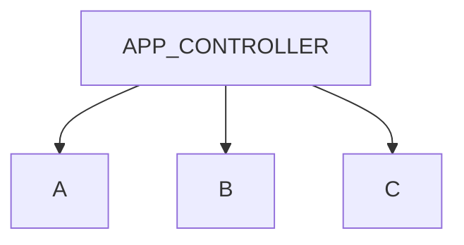

# QT Concept Instruction

## Change Layout Between Window Classes

- `A`, `B`, `C`

  Classes with only properties

- `APP_CONTROLLER`

  Class with window info and functions(include ways to change between classes)
  Class can access subWindow class' properties instead of using return

